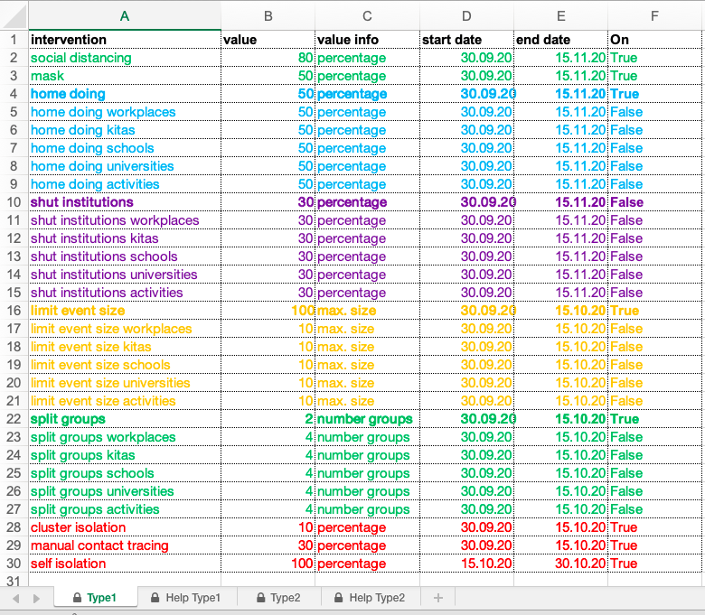
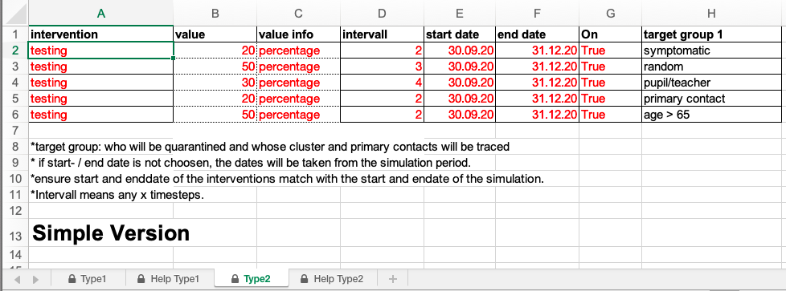

# interventions.xls

The interventions.xls has two sheets "Type1" and "Type2". It is meant to adjust public interventions to mitigate the disease.

### Sheet Type1

1. Select an intervention from column A and activate it by setting column F to "True". Unactivate by setting to "False".
2. Set start and end date and ensure it overlaps with the simulation dates (which are set in the StartUp.py in the _setGUI function).
3. Set the value for the intensity of the intervention in column B (percentage of implementation/number of groups/number of people).
4. Save the file.

### Sheet Type2

Type 2 interventions deal with testing strategies.

1. Select a "target group" from column H and activate the intervention by setting column G to "True". Unactivate by setting to "False".
2. Set start and end date and ensure it overlaps with the simulation dates (which are set in the StartUp.py in the _setGUI function).
3. Set the value in column B, which resembles the percentage of people from the target group to be tested.
4. Choose an intervall in column D (perform test each x days).
5. Save the file.
